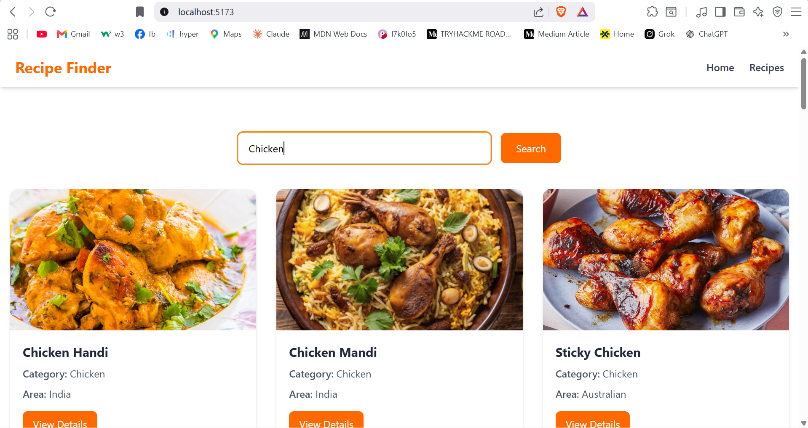
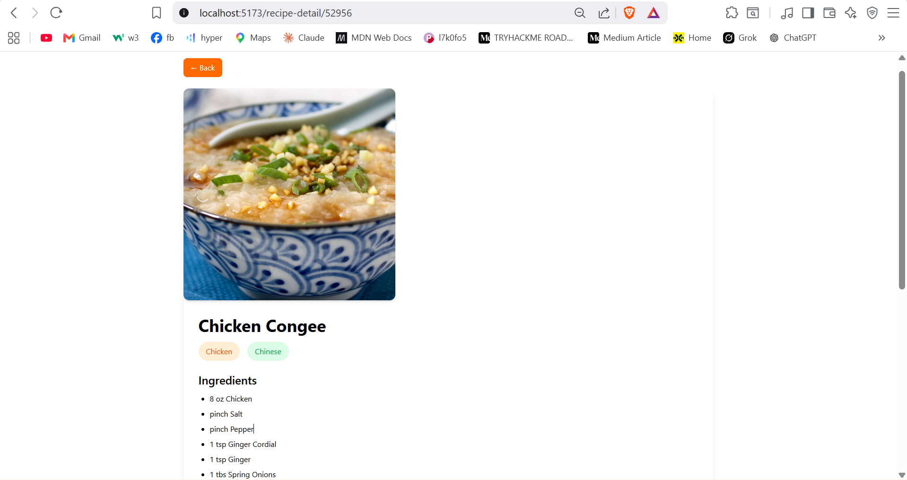

# Recipe Finder

A modern and responsive Recipe Finder web application built with React, Tailwind CSS, and TheMealDB API. Users can search for recipes, view detailed cooking instructions, explore ingredients, and access recipe tutorials.

## Live Demo

🌐 Live Site: https://recipe-finder-asif-hasan.netlify.app/

---

## Overview

Recipe Finder allows users to search for recipes by meal name and instantly view recipe details, ingredients, categories, and cooking instructions.

The application fetches real-time recipe data from TheMealDB API and presents it in a clean, responsive user interface.

---

## Features

- Search recipes by meal name
- View recipe details
- Display ingredients and measurements
- Detailed cooking instructions
- Direct YouTube tutorial link (if available)
- Fully responsive design
- Fast API-powered search
- Modern UI with Tailwind CSS
- Loading and error handling

---

## Tech Stack

### Frontend

- React.js
- React Router DOM
- Tailwind CSS
- JavaScript (ES6+)

### API

- TheMealDB API

### Deployment

- Netlify

---

## Project Structure

```bash
src/
│
├── components/
│   ├── Navbar.jsx
│   ├── SearchBar.jsx
│   └── RecipeCard.jsx
│
├── pages/
│   ├── Home.jsx
│   └── RecipeDetails.jsx
│
├── services/
│   └── recipeApi.js
│
├── App.jsx
└── main.jsx
```

---

## Installation

### Clone Repository

```bash
git clone https://github.com/YOUR_USERNAME/recipe-finder.git
```

### Navigate to Project

```bash
cd recipe-finder
```

### Install Dependencies

```bash
npm install
```

### Run Development Server

```bash
npm run dev
```

Application will run at:

```bash
http://localhost:5173
```

---

##  API Endpoint Used

Search Recipes:

```bash
https://www.themealdb.com/api/json/v1/1/search.php?s=
```

Get Recipe Details:

```bash
https://www.themealdb.com/api/json/v1/1/lookup.php?i=
```

---

## Screenshots

### Home Page



### Recipe Details



> Create a `screenshots` folder and add project screenshots for better presentation.

---

## Learning Outcomes

This project helped me practice:

- React Components
- Props & State Management
- React Router
- Fetch API
- Async/Await
- Conditional Rendering
- Responsive Design
- API Integration
- Tailwind CSS
- Project Structure Organization

---

## Author

**Asif Hasan**

- GitHub: https://github.com/asifhasanplabon
- LinkedIn: https://linkedin.com/in/plabon010

---

## 📄 License

This project is open-source and available under the MIT License.

---

⭐ If you like this project, consider giving it a star on GitHub.